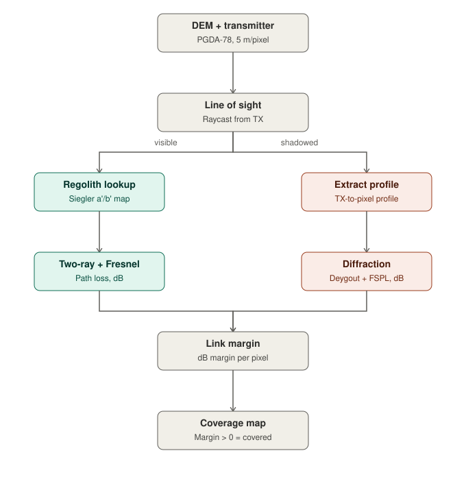
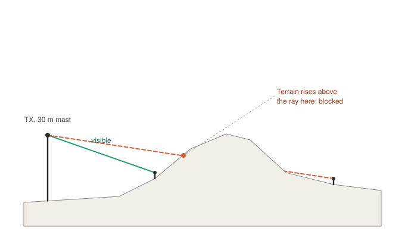

# lunar-comms-survey — S1 Surface RF Propagation & Coverage

A validated, open-source Python pipeline for predicting radio coverage on
the lunar surface, combining LOLA/PGDA-78 terrain diffraction with
spatially-variable regolith dielectrics. Built as the Student-1 (S1) track
of a summer research project on lunar wireless communications.

## What this is

Given a transmitter location on a real lunar DEM (LOLA/PGDA-78, 5 m/pixel),
this pipeline predicts, for every point in the surrounding terrain, whether
a receiver would have a working radio link — accounting for:

- **Free-space and two-ray propagation**, including a real Fresnel
  reflection coefficient derived from regolith permittivity.
- **Spatially-variable regolith dielectric loss**, from validated global
  loss-tangent maps.
- **Terrain diffraction** over crater rims and ridges (ITU-R P.526-15
  Deygout multi-edge method), using real line-of-sight raycasting over the
  DEM.

The headline finding: **on real terrain at the lunar south pole, coverage
is set by terrain blockage, not by path loss.** A flat-ground, free-space
model predicts ~100% coverage over a 2 km test area at Connecting Ridge;
the terrain-aware model predicts 68.5% — the missing 31.5% is signal lost
to line-of-sight shadowing behind ridges and crater rims, an effect no
prior published lunar coverage model (e.g. Edwards et al., 2023) captures.

## Pipeline overview



Each pixel's line-of-sight status determines which physics model applies:
visible pixels use two-ray propagation with a real Fresnel reflection
coefficient sampled from the Siegler regolith map; shadowed pixels use
free-space loss plus Deygout diffraction over the extracted terrain profile.
Both paths merge into a per-pixel link margin.



The line-of-sight check itself: for every pixel, the terrain elevation
profile between the transmitter and that pixel is compared against the
straight sight line joining their antenna heights. If the terrain rises
above that line anywhere along the path, the pixel is shadowed.

## Key findings

- **Terrain dominates coverage.** Four-level fidelity comparison (Friis →
  two-ray → +Deygout diffraction → +spatial dielectric) isolates each
  physical effect: multipath ≈0% change, terrain diffraction −31.5%,
  spatial dielectric ≈0% at the nominal link budget.
- **The terrain-blockage penalty grows with frequency, as predicted.**
  Tested across UHF (0.442 GHz), S-band (2.5 GHz), and Ka-band (27 GHz) on
  the same real terrain: penalty rises 5.1% → 31.5% → 47.4%, consistent
  with the Fresnel-Kirchhoff diffraction parameter's ν ∝ √f scaling
  (verified to zero numerical difference against theory).
- **Dielectric variation is real but link-budget-conditional.** Regolith
  permittivity produces a genuine, angle-dependent margin effect (up to
  3 dB), but it only changes binary coverage under a stressed link budget —
  under the generous Edwards (2023) parameters, every line-of-sight pixel
  sits 50–90 dB above threshold, so a few dB of dielectric sensitivity
  never flips a pixel's covered/uncovered status.
- **A pre-registered prediction was tested and rejected.** It was predicted
  that dielectric sensitivity would be small at S-band and larger at
  Ka-band (reasoning from diffraction's frequency scaling). Measured
  result: the opposite — S-band's effect (3.44% max coverage change) is
  over 4× larger than Ka-band's (0.80%), because the Fresnel reflection
  coefficient's dependence on real permittivity has no meaningful frequency
  term, unlike diffraction. This comparison was independently re-verified
  at 10× finer EIRP resolution after an initial coarse sweep was found to
  understate both bands' true sensitivity unevenly.

## Repository structure

```
lunar-comms-survey/
├── lunarcomms/                  # installable Python package
│   ├── regolith/
│   │   └── dielectric.py        # Olhoeft+Strangway 1975 permittivity;
│   │                             # Siegler 2020 spatially-variable loss tangent
│   ├── propagation/
│   │   ├── friis.py             # free-space path loss
│   │   ├── two_ray.py           # two-ray ground reflection, real & spatial Fresnel
│   │   └── diffraction.py       # ITU-R P.526-15 knife-edge + Deygout multi-edge
│   ├── coverage/
│   │   └── link_budget.py       # combines LOS + two-ray + Deygout into a
│   │                             # link-margin map; exports GeoTIFF
│   ├── io/
│   │   └── pgda.py              # PGDA DEM reader; Siegler a'/b' map sampler
│   └── geometry/
│       └── horizon.py           # line-of-sight raycasting from a fixed TX,
│                                 # terrain profile extraction (this track's own)
│                                 # (frames.py: shared Earth-Moon geometry
│                                 #  utility inherited from the project scaffold)
│
├── build_dielectric.py          # generator: writes regolith/dielectric.py
├── build_pgda.py                # generator: writes io/pgda.py
│                                 # (edit these, not the generated modules —
│                                 #  re-running a generator overwrites its output)
│
├── analysis/                    # investigation & validation scripts (not
│   │                             # part of the installable package)
│   ├── run_baseline_table.py        # 4-level fidelity comparison
│   ├── run_baseline_3level.py       # 3-level fallback (no Siegler files needed)
│   ├── run_threeband_baseline.py    # UHF/S/Ka terrain-aware comparison + figure
│   ├── dielectric_sensitivity.py    # incidence-angle + forced-permittivity checks
│   ├── dielectric_sensitivity_v2.py # per-pixel margin sensitivity diagnostic
│   ├── link_budget_stress_test.py   # coverage-% sensitivity vs EIRP sweep
│   ├── dielectric_by_band.py        # S-vs-Ka dielectric prediction test
│   ├── dielectric_by_band_recheck.py# same, at 10x finer EIRP resolution
│   ├── margin_sensitivity_by_band.py# per-pixel margin sensitivity, S vs Ka
│   ├── coverage_delta_evidence.py   # standalone repro of the S-vs-Ka result
│   ├── nu_frequency_scaling_evidence.py # verifies nu ~ sqrt(f) against theory
│   ├── coverage_vs_eirp.py          # coverage-vs-EIRP curves (LOS-only)
│   ├── coverage_vs_eirp_terrain.py  # coverage-vs-EIRP, full terrain-aware
│   ├── coverage_vs_eirp_zoom.py     # zoomed sign-flip visualisation
│   └── visualize_baseline.py        # 6-panel DEM + 4-level coverage figure
│
├── figures/                      # generated outputs (coverage maps, plots)
│
├── tests/
│   ├── test_regolith.py         # 23 tests, anchored to Siegler Table 1/Fig.8
│   │                             # and the Olhoeft & Strangway relation
│   ├── test_propagation.py      # 19 tests, anchored to ITU-R P.526-15,
│   │                             # Rappaport (1996), and analytic FSPL
│   └── test_geometry.py         # line-of-sight raycasting tests (this
│                                 # track's own) + shared Earth-Moon tests
│
├── data/
│   ├── dem/Site01/               # PGDA-78 DEM, Connecting Ridge (5 m/pixel)
│   ├── dem/Site04/                # PGDA-78 DEM, Shackleton rim
│   ├── kernels/                   # SPICE kernels (de440.bsp not tracked —
│   │                               # see data/download_kernels.py)
│   └── Figure 11_Constant Loss Parameter_a'.txt   # Siegler (2020) maps
│       Figure 11_Frequency Exponent_b'.txt
│
├── pyproject.toml, environment.yml, .gitignore, LICENSE
```

## Install

```
git clone https://github.com/hariniiisathya-coder/lunar-surface-communication-.git
cd lunar-surface-communication-
pip install -e ".[dev]"
```

or with conda:

```
conda env create -f environment.yml
conda activate lunarcomms
pip install -e ".[dev]"
```

## Data setup

DEMs for Site01 and Site04 are included in `data/dem/`. The SPICE ephemeris
kernel (`de440.bsp`, ~114 MB) is not tracked in git (exceeds GitHub's file
size limit) — download it from NAIF:

```
python data/download_kernels.py
```

The Siegler (2020) loss-tangent maps are Zenodo record
[10.5281/zenodo.3993798](https://doi.org/10.5281/zenodo.3993798) — place
`Figure 11_Constant Loss Parameter_a'.txt` and
`Figure 11_Frequency Exponent_b'.txt` in the project root.

## Run tests

```
pytest tests/ -v
```

42 tests in `test_regolith.py` + `test_propagation.py` pass, every expected
value anchored to a named primary source (not to hand-computed or assumed
values). `test_geometry.py`'s line-of-sight tests are this track's own; its
Earth-Moon distance tests are shared common-ground utilities.

## First result

```python
from lunarcomms.regolith import dielectric

rho = 1.50  # g/cm^3 (Carrier et al. 1991)

eps_r = dielectric.permittivity(rho)              # -> 2.658
tan_d = dielectric.loss_tangent(rho, 2.5)         # -> ~0.0019 at 2.5 GHz (uniform baseline)

print(f"eps' = {eps_r:.3f},  tan d = {tan_d:.4f}")
```

For the spatially-variable loss tangent (the validated Siegler form used
throughout the coverage pipeline):

```python
from lunarcomms.io.pgda import sample_loss_tangent_params
from lunarcomms.regolith.dielectric import loss_tangent_ab

a, b = sample_loss_tangent_params(lat=-89.4, lon=222.0,
                                   a_path="Figure 11_Constant Loss Parameter_a'.txt",
                                   b_path="Figure 11_Frequency Exponent_b'.txt")
tan_d = loss_tangent_ab(a, b, freq_ghz=2.5)
```

## Run the analysis scripts

All scripts in `analysis/` must be run **from the project root** (they
reference `data/` and the Siegler `.txt` files with root-relative paths):

```
python3 analysis/run_baseline_table.py         # the 4-level decomposition
python3 analysis/run_threeband_baseline.py     # UHF/S/Ka comparison + figure
python3 analysis/dielectric_sensitivity.py     # incidence-angle + rock-eps checks
```

## References

| Reference | What it provides | Link |
|---|---|---|
| Olhoeft & Strangway (1975), EPSL 24, 394–408 | Real permittivity ε′ = 1.919^ρ | [doi:10.1016/0012-821X(75)90146-6](https://doi.org/10.1016/0012-821X(75)90146-6) |
| Siegler et al. (2020), JGR Planets 125, e2020JE006405 | Global regolith loss-tangent maps, Figure 8, Table 1 | [doi:10.1029/2020JE006405](https://doi.org/10.1029/2020JE006405) |
| Siegler et al. (2020) — Zenodo dataset | a′/b′ loss-tangent fit coefficient maps | [doi:10.5281/zenodo.3993798](https://doi.org/10.5281/zenodo.3993798) |
| Rappaport (1996), *Wireless Communications: Principles and Practice*, Prentice Hall, ch. 3 | Two-ray ground reflection model, breakpoint distance | ISBN 0-13-375536-3 |
| ITU-R Recommendation P.526-15 (2019) | Knife-edge and Deygout multi-edge diffraction | [itu.int/rec/R-REC-P.526](https://www.itu.int/rec/R-REC-P.526/en) |
| Mazarico et al. (2011), Icarus 211, 1066–1081 | South-pole horizon/illumination raycasting method | [doi:10.1016/j.icarus.2010.10.030](https://doi.org/10.1016/j.icarus.2010.10.030) |
| Edwards et al. (2023), NASA NTRS 20220015268 | South-pole link-budget parameters; Friis-only coverage baseline | [ntrs.nasa.gov/citations/20220015268](https://ntrs.nasa.gov/citations/20220015268) |
| Balanis (2012), *Advanced Engineering Electromagnetics*, Wiley | Fresnel reflection coefficient, coherent two-ray interference theory | ISBN 978-0470589489 |
| Adebowale & Ostermann (2026), *Telecom* 7(1), 21 | Site-specific lunar 5G path-loss exponents (2.54–4.33, Shoemaker Rim F, ray-tracing), the benchmark for this project's planned PLE validation | [doi:10.3390/telecom7010021](https://doi.org/10.3390/telecom7010021) |

**Not yet implemented — references for a planned extension** (a stratified-regolith, multi-layer FIR channel model with subsurface dielectric interfaces, discussed as future work but not part of the current codebase):

| Reference | What it provides | Link |
|---|---|---|
| Wait (1962), *Electromagnetic Waves in Stratified Media*, Pergamon Press | Recursive impedance method for multilayer reflection coefficients | [archive.org/details/electromagneticw0000wait](https://archive.org/details/electromagneticw0000wait) |
| Orfanidis, *Electromagnetic Waves and Antennas*, Rutgers University | Multilayer dielectric reflection/transmission via impedance recursion (ch. 4 in the cited draft) | [ece.rutgers.edu/~orfanidi/ewa](https://www.ece.rutgers.edu/~orfanidi/ewa/) |

## License

MIT License. See `LICENSE`.
